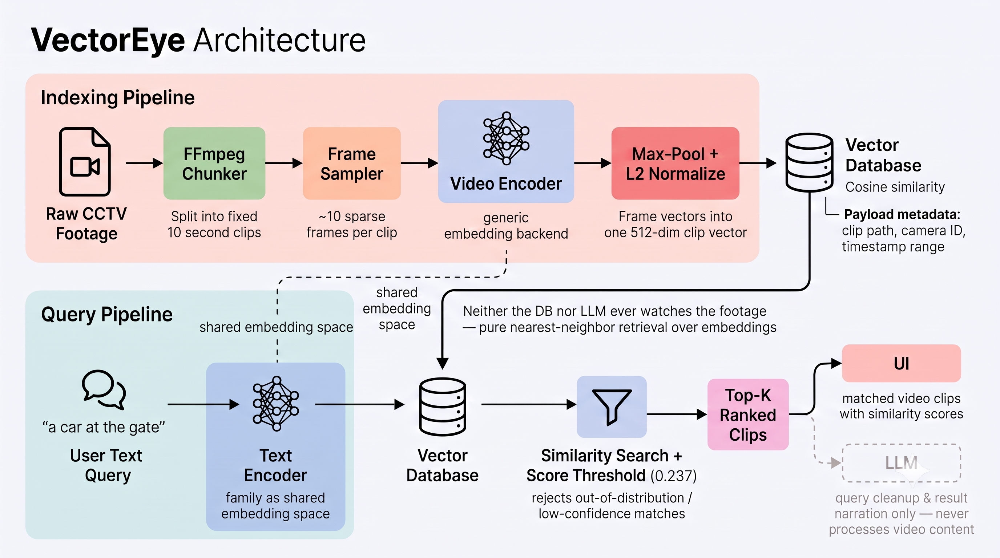

```
█   █ █████  ███  █████  ███  ████  █████ █   █ █████   
█░  █░█░░░░░█ ░░░  ░█░░░█ ░░█ █░░░█ █░░░░░ █ █ ░█░░░░░  
█░░ █░████░░█░ ░░░  █░░░█░ ░█░████░░████░░░ █ ░ ████░░░ 
 █░█ ░█░░░░ █░░     █░░ █░░ █░█░░█░ █░░░░   █░ ░█░░░░   
  █ ░ █████░ ███    █░░  ███ ░█░░░█░█████░  █░░ █████░  
   ░ ░ ░░░░░  ░░░    ░░   ░░░ ░░░  ░ ░░░░░   ░░  ░░░░░  
    ░   ░░░░░  ░░░    ░    ░░░  ░   ░ ░░░░░   ░   ░░░░░ 
```


A plug-and-play semantic search engine for **any video library** —
surveillance/CCTV archives, media libraries, sports or event footage,
dashcam/bodycam recordings, personal video collections, anything where you
have a pile of video and want to find the moment matching a description.
Recordings are chunked into short clips, embedded with CLIP into a shared
text-video vector space, and searched via natural-language query +
similarity search in Qdrant. **No LLM ever watches or reasons about video
content** — retrieval is pure nearest-neighbor over embeddings, so it scales
to large libraries without per-clip LLM cost. Groq (free tier) is used only
to clean up the user's query text and narrate results, never to look at
footage.

The system doesn't assume anything domain-specific about the source
footage — clips are grouped under a generic `camera_id` (in practice: a
source video, a camera feed, a recording device, or whatever identifier
makes sense for your library) with optional filtering, so the same pipeline
works whether you're searching CCTV recordings for "a red car at the gate"
or a personal video archive for "the dog running on the beach."

## Stack

- **Chunking**: FFmpeg (fixed-length, overlapping segments — configurable)
- **Visual embedding**: CLIP (`open_clip`, `ViT-B-32`/openai weights, or a
  Long-CLIP backend), sparse frame sampling + max-pool per clip
- **Speech-content search (optional)**: `faster-whisper` (`tiny`, CPU) with
  its built-in VAD skips clips with no detected speech; transcripts are
  embedded separately with `sentence-transformers` (`all-MiniLM-L6-v2`) and
  fused with the visual ranking at query time via Qdrant's native
  Reciprocal Rank Fusion — see "Speech-content search" below
- **Vector DB**: Qdrant (self-hosted via Docker)
- **API**: FastAPI (`/search` — raw retrieval, `/chat` — Groq-wrapped)
- **Chat**: Groq free-tier API, query-side only

## Architecture



All models are open-weight and run locally/CPU-only. Groq is the one
externally-hosted piece, isolated to the non-critical chat layer. Nothing
about the pipeline is CCTV-specific — swap in whatever video library you
have and it works the same way.

## Setup

```bash
uv sync
cp .env.example .env   # fill in GROQ_API_KEY if you want the /chat endpoint
docker compose up -d   # starts Qdrant on localhost:6333
```

Place the source videos in `data/raw_videos/` (`.mp4`/`.mov`/`.mkv`/`.avi`).

## Run the pipeline

```bash
uv run python scripts/run_pipeline.py
```

This chunks every video in `data/raw_videos/` into `data/clips/`, embeds
each clip with CLIP, and upserts them into the Qdrant `video_clips`
collection.

## Streamlit demo UI

```bash
uv run streamlit run app/ui/streamlit_app.py
```

Type a query, optionally toggle "Groq chat mode" (requires `GROQ_API_KEY`),
and view the matched clips with inline playback. Talks directly to the
retrieval code — no separate API process needed for the demo.

## Speech-content search (optional)

In addition to visual (CLIP) search, VectorEye can search *what's said* in a
clip's audio — useful for moments a visual query can't cleanly describe
("someone shouting after a sudden stop" has no clean CLIP-searchable visual
equivalent, but the words are right there in the audio).

- Controlled by `ENABLE_AUDIO_SEARCH` (default `true`) in `.env`/`app/config.py`.
  When on, indexing runs each clip's audio through VAD-gated Whisper
  transcription — clips with no detected speech are skipped entirely, no
  wasted embedding cost.
- Each clip's transcript (when present) is stored as a second, independent
  named vector (`transcript`) alongside the visual one (`visual`) on the
  same Qdrant point — not a separate collection, and not blended into the
  CLIP embedding (CLIP's text encoder isn't suited to general sentence
  semantics, so transcripts get their own embedding model and vector space).
- At query time, pass `use_transcript_fusion=True` to `search_clips()` (or
  toggle "Fuse in speech content" in the Streamlit UI) to combine the
  visual and transcript rankings via Qdrant's native RRF fusion. Off by
  default — fusion isn't purely additive, it can slightly reorder results
  even for visual-only queries, so it's opt-in rather than always-on.
- Cost: on CPU, VAD+transcription adds roughly 25–40% to per-clip indexing
  time (visual embedding stays the dominant cost); a fusion-enabled search
  runs ~15% slower than visual-only. All models load lazily and are cached
  for the life of the process — the Streamlit UI pre-warms them at startup
  so the first search a user runs isn't the one that pays the load cost.

## Serve the API

```bash
uv run uvicorn app.main:app --reload
```

- `POST /search {"query": "blue car at the gate"}` — raw CLIP+Qdrant
  retrieval, no LLM involved.
- `POST /chat {"query": "..."}` — same retrieval, wrapped with Groq for
  query cleanup + a conversational summary of results.
- `GET /clip/{filename}` — serves a matched clip file for playback.

## Retrieval evaluation (RAGAS)

This system never generates a text answer grounded in video content, so
RAGAS's generation-facing metrics (faithfulness, answer relevancy) don't
apply. What's evaluated instead is retrieval quality itself, via RAGAS's
**ID-based context precision/recall** — pure clip-ID matching against a
hand-labeled ground truth, no LLM judge involved.

1. Fill in `data/eval_queries.json` with real queries and the correct clip
   filenames for each (label these by watching the actual footage).
2. `uv run python -m app.eval.ragas_eval`

Reports per-query and mean context precision/recall.

