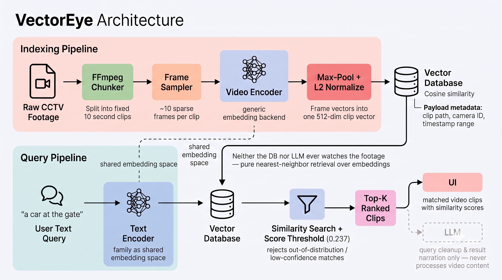

```
█   █ █████  ███  █████  ███  ████  █████ █   █ █████   
█░  █░█░░░░░█ ░░░  ░█░░░█ ░░█ █░░░█ █░░░░░ █ █ ░█░░░░░  
█░░ █░████░░█░ ░░░  █░░░█░ ░█░████░░████░░░ █ ░ ████░░░ 
 █░█ ░█░░░░ █░░     █░░ █░░ █░█░░█░ █░░░░   █░ ░█░░░░   
  █ ░ █████░ ███    █░░  ███ ░█░░░█░█████░  █░░ █████░  
   ░ ░ ░░░░░  ░░░    ░░   ░░░ ░░░  ░ ░░░░░   ░░  ░░░░░  
    ░   ░░░░░  ░░░    ░    ░░░  ░   ░ ░░░░░   ░   ░░░░░ 
```


A plug-and-play semantic search engine for **any video library** —
surveillance/CCTV archives, media libraries, sports or event footage,
dashcam/bodycam recordings, personal video collections, anything where you
have a pile of video and want to find the moment matching a description.
Recordings are chunked into short clips, embedded with CLIP into a shared
text-video vector space, and searched via natural-language query +
similarity search in Qdrant. **No LLM ever watches or reasons about video
content** — retrieval is pure nearest-neighbor over embeddings, so it scales
to large libraries without per-clip LLM cost. Groq (free tier) is used only
to clean up the user's query text and narrate results, never to look at
footage.

The system doesn't assume anything domain-specific about the source
footage — clips are grouped under a generic `source_id` (in practice: a
source video, a camera feed, a recording device, or whatever identifier
makes sense for your library) with optional filtering, plus open-ended
`tags` (a flat list of labels) and `attributes` (a structured key/value
dict) for anything else a deployment wants to track — a trip name and
location, a course and lecture number, a camera site — none of it hardcoded
into the pipeline. So the same pipeline works whether you're searching CCTV
recordings for "a red car at the gate" or a personal video archive for "the
dog running on the beach."

## Stack

| Layer | Tech | Opt-in? | Config |
|---|---|---|---|
| Chunking | FFmpeg — fixed-length, overlapping segments | always on | configurable |
| Visual embedding | CLIP (`open_clip`, `ViT-B-32`/openai, or Long-CLIP) — sparse frame sampling + max-pool | always on | `EMBEDDING_BACKEND` |
| Speech-content search | `faster-whisper` (`tiny`, CPU, built-in VAD) + `sentence-transformers` (`all-MiniLM-L6-v2`), fused via Qdrant's native RRF | opt-in | `ENABLE_AUDIO_SEARCH`, `use_transcript_fusion` |
| On-screen text search (OCR) | Tesseract (`pytesseract`, system binary — no ML framework, no GPU/CUDA risk) + same sentence-transformer as above | opt-in | `ENABLE_OCR_SEARCH`, `use_ocr_fusion` |
| Attribute verification | Open-vocab object detector (`ultralytics` YOLO-World) + spaCy dependency parse — fixes CLIP's weak attribute-object binding (e.g. "blue car" scored as "blue" + "car" independently) | opt-in, experimental | `ENABLE_ATTRIBUTE_VERIFICATION` |
| Vector DB | Qdrant, self-hosted via Docker | always on | — |
| API | FastAPI — `/search`, `/chat`, `/ingest`, `/ingest/batch`, `/watch`, `/sources`, `/retention/sweep` | always on | — |
| Chat | Groq free-tier API, query-side only | opt-in | `GROQ_API_KEY` |

Every model-selection point above is either a single config value (swapping
checkpoints/sizes within a library) or a config value behind one dispatch
function with one loader per engine family (swapping libraries entirely,
e.g. Tesseract → PaddleOCR) — see each pipeline module's `_load_*`
functions. This means every backend in the table can be swapped without
touching any call site.

## Architecture



All models are open-weight and run locally/CPU-only. Groq is the one
externally-hosted piece, isolated to the non-critical chat layer. Nothing
about the pipeline is CCTV-specific — swap in whatever video library you
have and it works the same way.

## Setup

```bash
uv sync
cp .env.example .env   # fill in GROQ_API_KEY if you want the /chat endpoint
docker compose up -d   # starts Qdrant on localhost:6333
```

Storage is S3-compatible ([Floci](https://github.com/floci-io/floci) locally, any
S3 store in production). To keep Floci's buckets across restarts, start it with a
persistent data directory:

```bash
floci start --persist ~/.floci/data   # S3 on localhost:4566, data saved on disk
```

`setup.sh` (and `setup.bat`) create the two buckets if they're missing — re-run
`uv run python scripts/ensure_buckets.py` any time, it's idempotent. Upload videos
(`.mp4`/`.mov`/`.mkv`/`.avi`) to the `raw-videos` bucket; clips are written to the
`chunks` bucket. See
`.env.example` for the endpoint/credential/bucket settings (`S3_ENDPOINT`,
`S3_PUBLIC_ENDPOINT`, `S3_ACCESS_KEY`, `S3_SECRET_KEY`, `S3_REGION`,
`S3_VERIFY_SSL`, `RAW_VIDEOS_BUCKET`, `CLIPS_BUCKET`, `PRESIGN_EXPIRY_SECONDS`,
`VECTOREYE_PORT`).

The `clip_path` payload field in Qdrant is the clip's **S3 object key** in the
`chunks` bucket. If you are upgrading from the local-directory version, delete
the Qdrant collection and reindex (old points hold local filesystem paths).

## Run the pipeline

```bash
uv run python scripts/run_pipeline.py
```

This chunks every video in the `raw-videos` bucket into the `chunks`
bucket, embeds each clip with CLIP, and upserts them into the Qdrant
collection. Embedding is incremental (already-indexed clips are skipped); pass
`--reindex-all` to re-embed everything.

## Streamlit demo UI

```bash
uv run streamlit run app/ui/streamlit_app.py
```

Type a query and view the matched clips with inline playback. Talks
directly to the retrieval code — no separate API process needed for the
demo. The sidebar has a toggle for each optional feature (see "Stack"
above; each disabled until its `ENABLE_*` flag is on and the collection has
been re-indexed with it): "Groq chat mode" (requires `GROQ_API_KEY`), "Fuse
in speech content", "Fuse in on-screen text", and "Verify attributes" — the
last three are independent and combinable.

## How to use the API

This section walks through setup and every endpoint with copy-pasteable
`curl` commands. Everything below assumes Qdrant is running
(`docker compose up -d`) and the API server is up:

```bash
uv run uvicorn app.main:app --host 0.0.0.0 --port 9100
```

### 1. Get video into the system (ingestion)

Videos live in the S3 raw-videos bucket (`RAW_VIDEOS_BUCKET`). `/index`
bulk-processes the whole bucket; the ingest API adds video one at a time, in
bulk, or continuously — without re-processing what's already indexed.

**One video at a time** — give the object key of a video already in the
raw-videos bucket and a `source_id` (whatever grouping makes sense for your
library: a camera name, a trip, a course), and optionally `tags`/`attributes`:

```bash
curl -X POST localhost:9100/ingest -H "Content-Type: application/json" -d '{
  "video_key": "front-gate/2024-06-01.mp4",
  "source_id": "front-gate-camera",
  "tags": ["site:hq"],
  "attributes": {"location": "Kyoto"}
}'
# {"job_id": "..."}
```

Chunking + embedding takes real time (seconds to minutes depending on
video length), so this returns immediately with a `job_id`. Poll it for
progress:

```bash
curl localhost:9100/ingest/<job_id>
# {"status": "embedding_indexing", ...}   -> then "done" or "failed"
```

A video that's already been ingested and hasn't changed since is
automatically **skipped** (status `"skipped"`) instead of re-processed —
add `"force": true` to the request body to re-process it anyway.

**Many videos at once** — for a static archive (a batch of teaching videos,
an existing folder of trip footage). Give a key prefix in the bucket (omit it
for every video) and each video gets its own ingest job, with its own
filename-derived `source_id` unless you give one explicitly per file:

```bash
curl -X POST localhost:9100/ingest/batch -H "Content-Type: application/json" -d '{
  "prefix": "archive/",
  "tags": ["archive:2024"]
}'
# {"batch_id": "...", "job_ids": [...]}

curl localhost:9100/ingest/batch/<batch_id>
# shows every job's status plus one overall status: "running" / "done" / "failed"
```

(Or pass an explicit `"videos": [{"video_key": "...", "source_id": "..."}, ...]`
list instead of `"prefix"` if each video needs its own metadata.)

**A prefix that keeps getting new files** — for a live source like a CCTV
NVR uploading to the bucket. Register it once and it's watched automatically:

```bash
curl -X POST localhost:9100/watch -H "Content-Type: application/json" -d '{
  "prefix": "nvr-export/",
  "tags": ["camera:lobby"],
  "interval_seconds": 30
}'
# {"watch_id": "..."}
```

Every 30 seconds it checks the prefix for new or changed files and
auto-ingests them — already-processed, unchanged files are skipped, so
re-checking a mostly-unchanged prefix is cheap.

```bash
curl localhost:9100/watch/<watch_id>       # status + list of jobs it triggered
curl localhost:9100/watch                  # list every registered watch
curl -X DELETE localhost:9100/watch/<watch_id>   # stop watching
```

### 2. Search

```bash
curl -X POST localhost:9100/search -H "Content-Type: application/json" -d '{
  "query": "blue car at the gate",
  "top_k": 5
}'
```

Raw CLIP+Qdrant retrieval, no LLM involved. Narrow it down with
`"source_id": "front-gate-camera"` (match one source), or a more general
`"filters"` list for anything in `tags`/`attributes`:

```bash
curl -X POST localhost:9100/search -H "Content-Type: application/json" -d '{
  "query": "blue car at the gate",
  "filters": [
    {"field": "tags", "op": "eq", "value": "site:hq"},
    {"field": "attributes.location", "op": "in", "value": ["Kyoto", "Osaka"]}
  ]
}'
```

`op` is `"eq"` (exact match) or `"in"` (matches any value in a list).

Fold in speech content or on-screen text (both opt-in, both need indexing
with `ENABLE_AUDIO_SEARCH`/`ENABLE_OCR_SEARCH` on — see "Stack" above — to
have anything to fuse in) with `"use_transcript_fusion": true` and/or
`"use_ocr_fusion": true` — combinable together for a 3-way fusion:

```bash
curl -X POST localhost:9100/search -H "Content-Type: application/json" -d '{
  "query": "what did the sign say at the gate",
  "use_ocr_fusion": true
}'
```

Want a conversational answer instead of raw hits? Use `/chat` (needs
`GROQ_API_KEY` in `.env`) — same retrieval underneath, just narrated:

```bash
curl -X POST localhost:9100/chat -H "Content-Type: application/json" -d '{
  "query": "did anyone show up at the gate last night"
}'
```

Each search result carries `clip_url` (a presigned URL, signed against
`S3_PUBLIC_ENDPOINT`) for playback; `clip_path` is the clip's S3 key. As a
fallback, `/clip/{key}` proxies the clip from S3:

```bash
curl localhost:9100/clip/front-gate-camera_clip000010.mp4 --output clip.mp4
```

### 3. Bulk indexing and health

```bash
curl localhost:9100/health        # {"status": "ok"|"degraded", "s3": ..., "qdrant": ...}
curl -X POST localhost:9100/index -H "Content-Type: application/json" -d '{"video_key": null, "reindex_all": false}'
curl localhost:9100/index/<job_id>   # queued / chunking / indexing / done / error
```

`/index` chunks every video in the raw-videos bucket (or just `video_key`) and
indexes the clips as one background job (202; 409 if one is already running).
Don't run it during live search traffic: it shares the API process's CPU.

### 4. See what's indexed, and clean it up

```bash
curl localhost:9100/sources               # every source_id, with clip counts
curl localhost:9100/sources/<source_id>   # detail for one source
curl -X DELETE localhost:9100/sources/<source_id>   # delete it (Qdrant + clips bucket)
```

For a source that should auto-expire (a CCTV rolling window), set
`retention_days` in its `attributes` at ingest time — anything past that
age gets deleted automatically if you turn on the background sweep
(`ENABLE_RETENTION_SWEEP=true` in `.env`), or trigger a sweep manually any
time:

```bash
curl -X POST localhost:9100/retention/sweep
# {"deleted": 12}
```

## Retrieval evaluation (RAGAS)

This system never generates a text answer grounded in video content, so
RAGAS's generation-facing metrics (faithfulness, answer relevancy) don't
apply. What's evaluated instead is retrieval quality itself, via RAGAS's
**ID-based context precision/recall** — pure clip-ID matching against a
hand-labeled ground truth, no LLM judge involved.

1. Fill in `data/eval_queries.json` with real queries and the correct clip
   **keys** (same as filenames when clips have no key prefix) for each (label these by watching the actual footage).
2. `uv run python -m app.eval.ragas_eval`

Reports per-query and mean context precision/recall.

## License

MIT — see [LICENSE](LICENSE).

